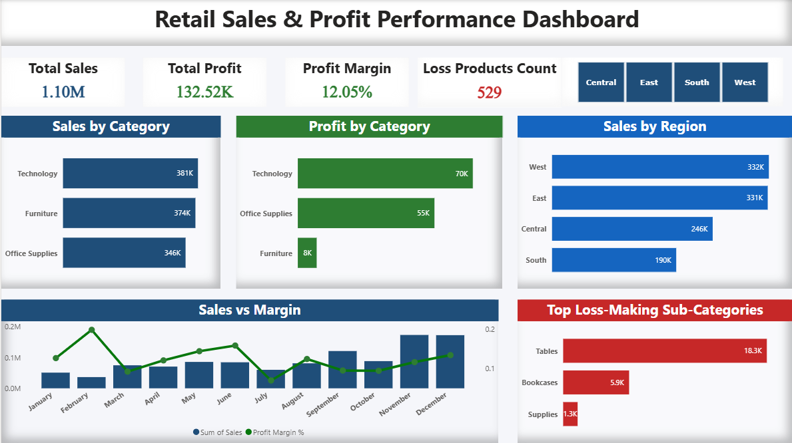

Retail Sales & Profit Performance Analysis

Project Overview

This project analyzes retail sales performance using SQL and Power BI using the Superstore dataset. The objective of this project is to identify important business insights related to sales, profit, and loss-making products across different regions and product categories. The dashboard helps understand overall business performance and supports data-driven decision making.

Tools Used

SQL – Data analysis and aggregation  
Power BI – Data visualization and dashboard creation  

Dashboard Preview

Key Metrics

Total Sales: 1.10M  

Total Profit: 132.52K  

Profit Margin: 12.05%  

Loss Products Count: 529  

Key Insights

1. Technology category generates the highest revenue and profit.  
Technology contributes the largest share of both sales and profit compared to other product categories.

2. Furniture category has high sales but very low profit.  
Although furniture generates strong sales, the profit is very low which indicates possible high costs or heavy discounts.

3. West region records the highest sales.  
Among all regions, the West region contributes the highest revenue while the South region records the lowest sales.

4. Tables and Bookcases are the biggest loss-making sub-categories.  
These products generate significant negative profit, suggesting potential issues in pricing or discount strategies.

5. Sales and profit margins fluctuate across months.  
Monthly sales analysis shows variations in revenue and margin, indicating seasonal demand patterns.

6. Several products generate negative profit.  
A number of products consistently create losses, highlighting opportunities for cost optimization or pricing adjustments.

SQL Analysis

SQL queries were used to perform data aggregation and calculate key metrics before building the Power BI dashboard.

The SQL analysis includes:

Total Revenue calculation  

Total Profit calculation  

Profit Margin percentage  

Sales by Category  

Profit by Region  

Monthly Sales Trend  

Loss-Making Products identification  

Top 5 Customers by Sales  

Project Files

Retail_Sales_Dashboard.pbix – Power BI dashboard file  

sales_analysis_queries.sql – SQL queries used for analysis  

dashboard.png – Dashboard screenshot  
